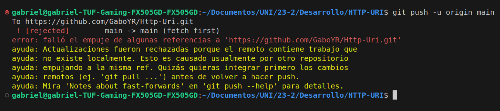
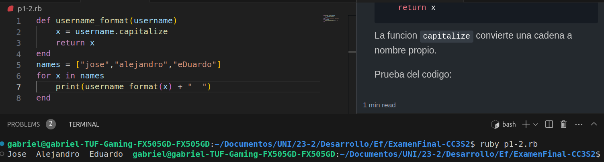
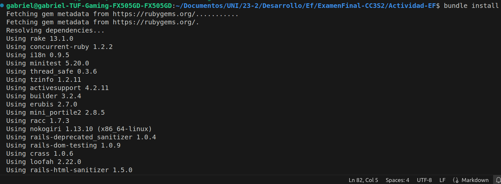
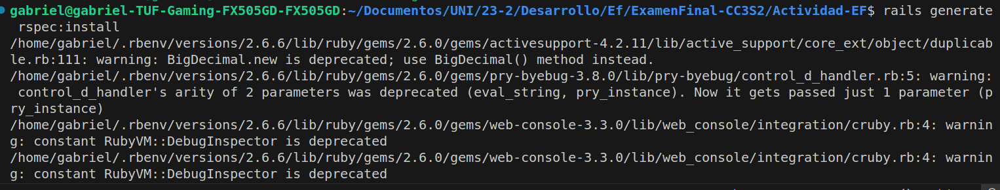
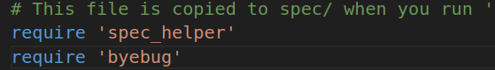
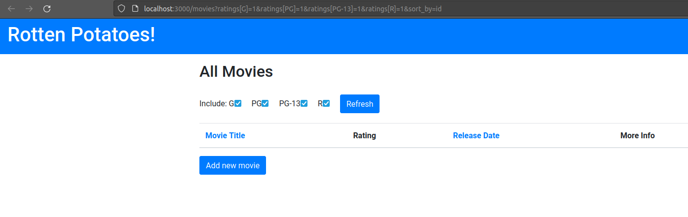

# ExamenFinal-CC3S2
## Parte 1

### 1

Piden generar un conflicto de fusión en cualquier repositorio.

Podemos modificar un archivo en remoto y desde local, hacer un `git push`.



Para solucionarlo, debemos sincronizar ambas zonas de trabajo.
Podemos usar `git fetch` para la recuperación de archivos de remoto a local.

Sincronizamos y un `git push` para subir los cambios.

### 2

Nos dan lo siguiente

```ruby
class User < ActiveRecord::Base
    validates :username, :presence => true
    validate :username_format
end
```

1. **¿Qué pasa si tenemos @user sin nombre de usuario y llamamos a @user.valid? ¿Qué guardará @user.save**

Vemos que `validates :username` tiene que ser una cadena no vacía debido al `presence => true`, entonces el mensaje que veremos al intentar una cadena vacía es:
`ActiveRecord::RecordInvalid: Validation failed: Name can't be blank`.

2. **Implementa username_format. Para los propósitos, un nombre de usuario comienza con una letra y tiene como máximo 10 caracteres de largo. Recuerda, las validaciones personalizadas agregan un mensaje a la colección de errores.**

```ruby
def username_format(username)
   x = username.capitalize
   return x
```

La funcion `capitalize` convierte una cadena a nombre propio.

Prueba del codigo en la terminal:


3. **Completa el método before_filter:check_admin a continuación que verifica si el campo de administrador en @user es verdadero. De lo contrario, redirija a la página admin_login con un mensaje que indica acceso restringido.**

```ruby
class AdminController < ApplicationController
  	before_filter :check_admin
    # Completa el codigo
    if @user.isadmin?
        return true
    end
    else 
        print ("Acceso restringido")
        return false
    end
end
```

4. **Solucion de jQuery**

```js
<form method="POST" id="foo">
<input type="text" class="user" />
<input type="password" class="pass" />
<input type="button" value="Log␣in" id="onSubmit" />
</form>
$("#onSubmit").click(function() {
    $.ajax({
        type = 'POST',
        url: $(this).attr('href'),
        timeout: 5000,
    })
})
```

## Parte 2

Agregamos las gemas faltantes al `Gemfile` y despues usamos `bundle install`.



Despues usamos el comando  `rails generate rspec:install`



Agregamos `require byebug`.



Despues el comando `exec guard init rspec ` que genera un `Guardfile`

Ejecutamos el comando `rake db:migrate` para generar la base de datos y finalmente el comando `rails server` para ver si todo esta bien.



### Parte 1

Creamos un directorio en `spec` de la siguiente forma  `spec/controllers` y ahí creamos `movies_controller_spec.rb`.

Debemos hacer dos cosas:
Primero ,inicializar el metodo `search_tmdb` en `movies_controller.rb` y colocar la ruta en `routes.rb`

El `guard` pasara el test despues de establecer la ruta.
